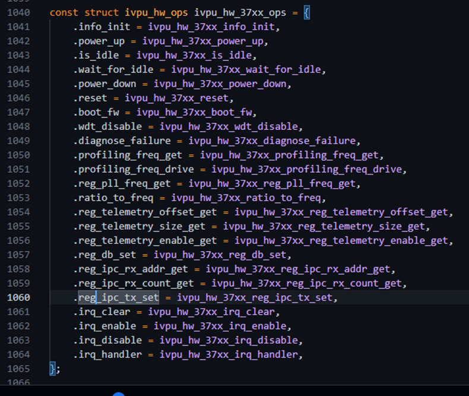

# 操作系统实验 第八周汇报

岳章乔 2021010706 [yuezq21@mails.tsinghua.edu.cn](mailto:yuezq21@mails.tsinghua.edu.cn) 2024.4.21

## 本周进展

• 核对了驱动的开发环境，把 Linux 内核版本升级为 6.8.1

• 对驱动进行编译，运行其单元测试

• 共有 178 个测试，有 10 个停用，6个没有通过


•对样例 (TinyLlama) 测试，出现异常

​	•OV::Exception: Failed to compile network

​	•https://github.com/openvinotoolkit/openvino/issues/22846

​	•**[Bug]: Quantized model does not compile for device type=NPU**

​	•Open issue


•

## 对内核驱动实现的资料调研

Intel 已经把驱动合并到内核实现

•Linux/drivers/accel/ivpu

•https://lwn.net/Articles/920233/

### 驱动初始化方法如下：

•`Module_init`(初始化函数，写入 file_operations 结构体）

•File_operations 结构体指定 `ioctl` 的处理函数

•调用处理函数实现进一步的处理

•CMD 有 _IO, _IOW, _IOR, _IOWR，规定不同的交互方式

• `Ivpu/ivpu_drv.c` 进行初始化

•（因为每次使用前，要 probe 一次，因此不能直接用 init/exit 模式 )

•`Include/uapi/drm/drm.h` 定义 CMD


### 驱动的核心实现主要放在下列文件：

•ivpu_drv

•Ivpu_fw – firmware parsing/booting

•Ivpu_hw37xx

•Ivpu_hw_reg_io

•ivpu_job – cmd buffer submission

•[ivpu_mmu] – intel vpu mmu

驱动提供的 IOCTL 接口如下：

```c
static const struct drm_ioctl_desc ivpu_drm_ioctls[] = {
    DRM_IOCTL_DEF_DRV(IVPU_GET_PARAM, ivpu_get_param_ioctl, 0),
    DRM_IOCTL_DEF_DRV(IVPU_SET_PARAM, ivpu_set_param_ioctl, 0),
    DRM_IOCTL_DEF_DRV(IVPU_BO_CREATE, ivpu_bo_create_ioctl, 0),
    DRM_IOCTL_DEF_DRV(IVPU_BO_INFO, ivpu_bo_info_ioctl, 0),
    DRM_IOCTL_DEF_DRV(IVPU_SUBMIT, ivpu_submit_ioctl, 0),
    DRM_IOCTL_DEF_DRV(IVPU_BO_WAIT, ivpu_bo_wait_ioctl, 0),
};

```

因为驱动是 job submission model，所以需要留意其 submit 功能段

•硬件控制基于寄存器状态读写，内核有 37XX 和 40XX 两种实现，提供对状态寄存器的封装。

留意 hw37 的实现，对应固件版本：

 

•状态寄存器的读写，在 ivpu_hw_reg_io.h 进行

•有个输入参数 ，类型是 io_mem ，其初始化在 ivpu_pci_init (ivpu_drv.c) 完成。

### 初始化信息如下：

•Register file BAR0, BAR4 -- devm_ioremap_resource

•Ivpu_probe 


### 驱动的加载：

•IVPU_BOOT: This function is paired with ivpu_shutdown() but it doesn't power up the VPU because power up has to be called very early in ivpu_probe().

### 下周展望

•接通 TinyLlama 推理过程

•驱动内部找到 firmware parser, 利用其对现有固件分析

•找出其可实现子集

•了解 Rust for Linux 的交互方式

•这周开始会调整开发模式，更频繁的与工程师们进行交流，适时调整方案。